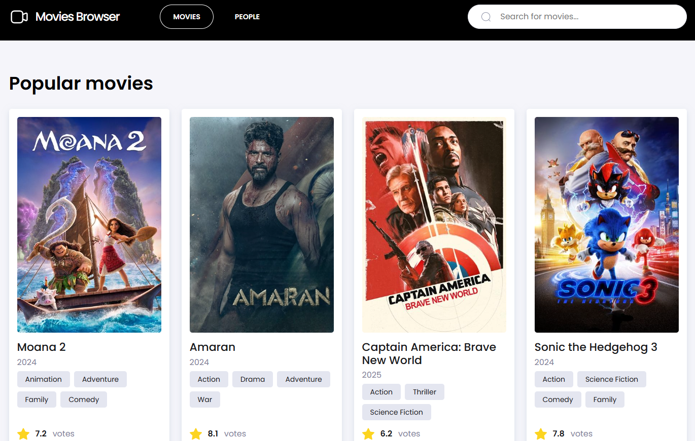

# 📽 Movies Browser 

Movie Browser is a web application that allows users to search, browse, and explore movies. It provides a user-friendly interface where users can view movie details, including titles, posters, release dates, and ratings. The application typically pulls movie data from API: The Movie Database (TMDB). Users can search for specific movies, actors and crew members, filter results, and even view additional information like movie and people descriptions. The main goal of the project is to offer an interactive, responsive, and efficient platform for discovering movies.

## 🌐 Demo

https://aleksandra-nie.github.io/movies-browser/

## 📥 API

The website fetches data from an external API: https://www.themoviedb.org/ 

## 📝 Features

- `🎬 Popular movie page`: a curated list of the most popular films.

- `🎥 Detailed Movie Information`:
  - Poster image
  - Cast & crew details
  - Ratings & votes
  - Release dates
  - Production country
  - Genres
  - Plot summary

- `🌟 Popular people page`: a list showcasing popular actors, directors, and other key figures in the film industry.

- `🧑‍🎤 Person Profile Information`:
  - Profile picture
  - Biography
  - Filmography
  - Personal details

- `🔍 Search Functionality`: easily search for both movies and celebrities.
  
- `📱 Mobile-Friendly Design`: fully responsive for a seamless experience across all devices.

- `⏳ Loading`: A loading spinner appears while data is being retrieved from the TMDb API what enables smooth visual transitions for a user-friendly experience.
  
- `⚠️ Error Handling`: an error screen message appears in case of API failures or missing data.
- `❎ No Results View`: A proper message is displayed when no search results are available.
- `⏪⏩ Page Navigation`: simple, intuitive buttons to move between pages.

- `🔄 Navigation`: fluid transitions when navigating between movie and person pages.

- `✨ Interactive Animations`: subtle hover effects on movie cards and custom loading animations.

## ⚙️ Technologies

- HTML
- JavaScript:
  - Error handling (try/catch)
  - fetch & axios
  - Promise, async/await
  - API request 
- React
- React Router v7.1.3
- Redux with react-redux v9.2.0
- Redux Saga v1.3.0
- Redux Toolkit
- Styling: Styled Components, normalize.css, GlobalStyle, Theme  
- CSS:
  - BEM
  - Flexbox
  - Grid
  - Media Queries
  - Transition, animation: fadein
    
 - React Hooks:
   - `useState`
     
   - `useEffect`
     
   - `useRef`
     
- React Router Hooks:
  - `useParams`
    
  - `useHistory`
  - `useLocation`
  - `useNavigate`
    
- Custom Hooks:
  - `useQueryParameter`
    
- Development Tools:
  - Create React App
  - Webpack
  - npm
  - Babel
 
## 💡 Presentation  

Below you can find a brief app presentation:

### Movies Main Page

### Movie Details Page 

### People Main Page

### Person Details Page

###  Search Functionality for Movies

###  Search Functionality for People

### No Results View

### Error View

## 📜 Available Scripts

This project was bootstrapped with [Create React App](https://github.com/facebook/create-react-app).

In the project directory, you can run:

### `npm start`

Runs the app in the development mode.\
Open [http://localhost:3000](http://localhost:3000) to view it in your browser.

The page will reload when you make changes.\
You may also see any lint errors in the console.

### `npm run build`

Builds the app for production to the `build` folder.\
It correctly bundles React in production mode and optimizes the build for the best performance.

The build is minified and the filenames include the hashes.\
Your app is ready to be deployed!

See the section about [deployment](https://facebook.github.io/create-react-app/docs/deployment) for more information.

### `npm run eject`

**Note: this is a one-way operation. Once you `eject`, you can't go back!**

If you aren't satisfied with the build tool and configuration choices, you can `eject` at any time. This command will remove the single build dependency from your project.

Instead, it will copy all the configuration files and the transitive dependencies (webpack, Babel, ESLint, etc) right into your project so you have full control over them. All of the commands except `eject` will still work, but they will point to the copied scripts so you can tweak them. At this point you're on your own.

You don't have to ever use `eject`. The curated feature set is suitable for small and middle deployments, and you shouldn't feel obligated to use this feature. However we understand that this tool wouldn't be useful if you couldn't customize it when you are ready for it.
